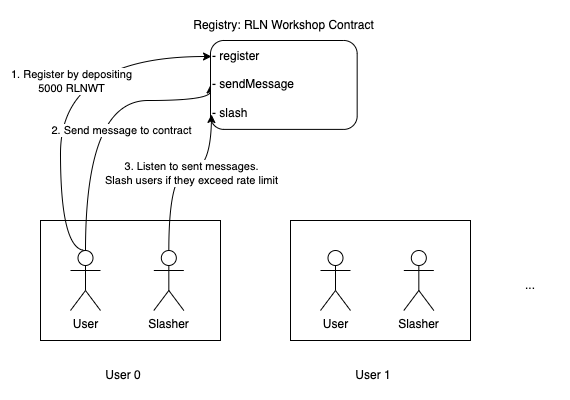

# RLN Workshop @ zkplayground.tw

This is a demonstration of how RLN can be used in the [RLN workshop](https://docs.google.com/presentation/d/16plPnuDyLYKPbPsJos6348wNsurjla255Y6nM1xI9AY/edit?usp=sharing) at [zkplayground.tw](https://zkplayground.tw/).




## Prerequisites
### 1. Ensure Metamask is installed in your browser.

### 2. Check your balance in your Metamask wallet.
- Use the Goerli testnet.
- Should be some ethers in your wallet.
- Add testing token `0x122488C20C026BAE7e139c4e61255d0fd60c88F1` to your wallet
  - Should be `1000` RLNWT in your wallet.

## Run

### 1. Install
```bash
npm install
```

### 2. Compile to code and run a web server

```bash
npm run build-and-run-server
```

### 3. Open the app in your browser.
```bash
open http://localhost:8080
```

## Fix `FIXME`s to make the app work :D
Or, see the branch [complete](https://github.com/mhchia/rln-workshop/tree/complete) for the complete code.

## Contract Addresses
- RLNWorkshop RLN Contract: http://goerli.etherscan.io/address/0xc0B896A89eba94Bd6DA2a6c85118e7856172F9C4
- RLNWorkshopToken Contract: http://goerli.etherscan.io/address/0x122488C20C026BAE7e139c4e61255d0fd60c88F1
- RLN Verifier Contract: http://goerli.etherscan.io/address/0xafEC45624F3d29ea86f5E73AbcbA83ee04dcEA5a
- Withdraw Verifier Contract: http://goerli.etherscan.io/address/0x6a2F1c50AE2018128F9Dfc6c3F7c99938d6E5851
